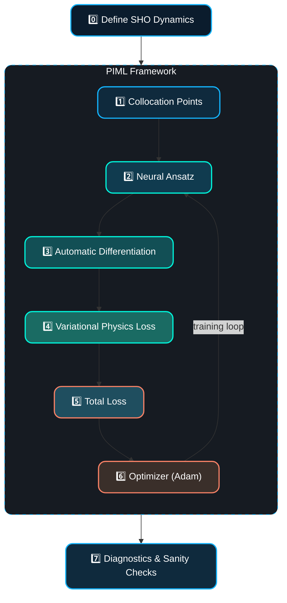

# Project 1 Architecture

## Mathematical Mapping

|**Step**|**Component**| **Mathematical   Description**                                                  |**Interpretation**| **Importance in Pipeline**                                                                                   |
|:-------|:------------|:-----------------------------------------------------------------------------------|:-----------------|:-------------------------------------------------------------------------------------------------------------|
| 0️⃣ | **Problem setup** | SHO Lagrangian and equations of motion                                             | Defines the physical system. | Provides the exact DE the network must respect.                                                              |
| 1️⃣ | **Collocation points** | $t\in [0, 2\pi]$                                                                   | Synthetic "data" for physics enforcement. | Keeps the pipeline purely physics-driven.                                                                    |
| 3️⃣ | **Automatic differentiation** | $p_\theta = \dot{q}_\theta \quad \text {and} \quad \ddot{q}_\theta$                | Recovers velocity and acceleration | Provides the quantities needed for the physics residual.                                                     |
| 4️⃣ | **Physics loss** | $\mathcal{L}_\text{phys} = \langle (\ddot{q}_\theta + \omega^2 q_\theta)^2\rangle$ | Encodes Euler-Lagrange structure | *Low fidelity* is maintained since the network only needs to reduce the residual (not satisfy it exactly).   |
| 5️⃣ | **Total loss** | $\mathcal{L}_\text{total} = \mathcal{L}_\text{phys}$                               | Low-fidelity PINN objective function | Highlights how pure physics can drive learning.                                                              |
| 6️⃣ | **Optimization** | $\theta_{k+1} = \theta_k - \eta \nabla_\theta \mathcal{L}_\text{total}$            | Gradient-based learning | Standard gradient descent; the dynamics of convergence reveal interpretability cure.                         |
| 7️⃣ | **Diagnostics** | $H_\theta(t) = H(q_\theta, p_\theta)$                                              | Sanity checks and structure validation | Makes failure modes explicit for analysis.                                                                   |