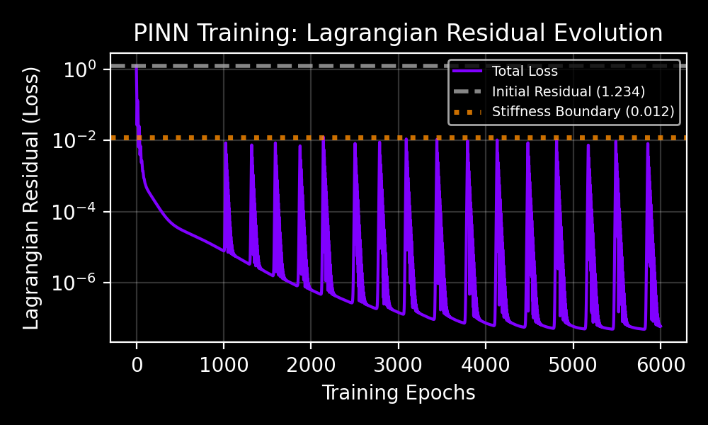
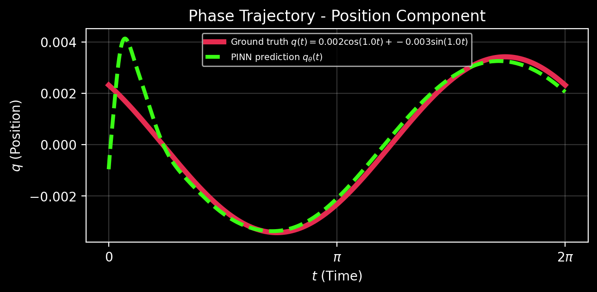
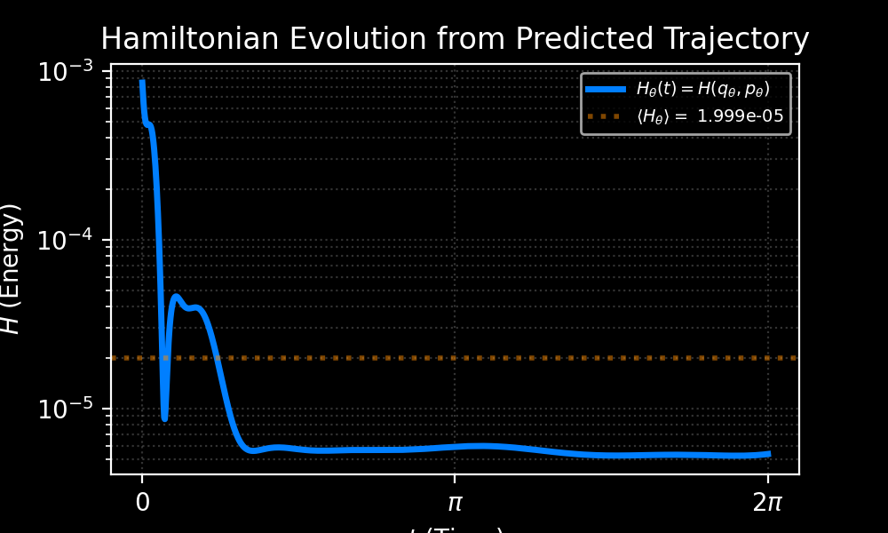
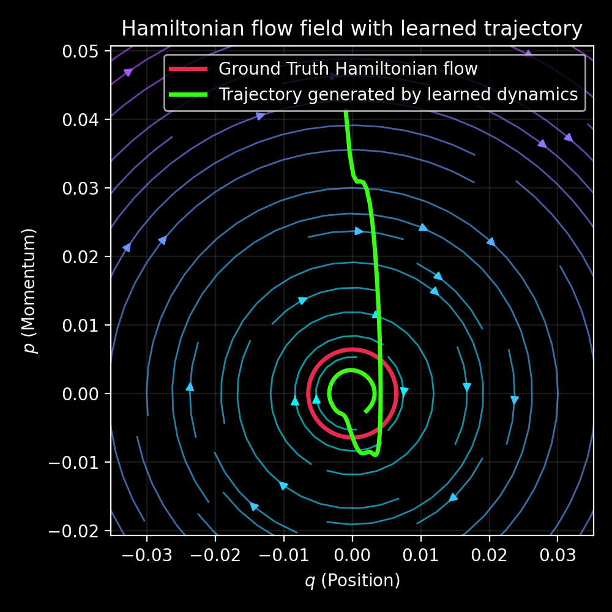
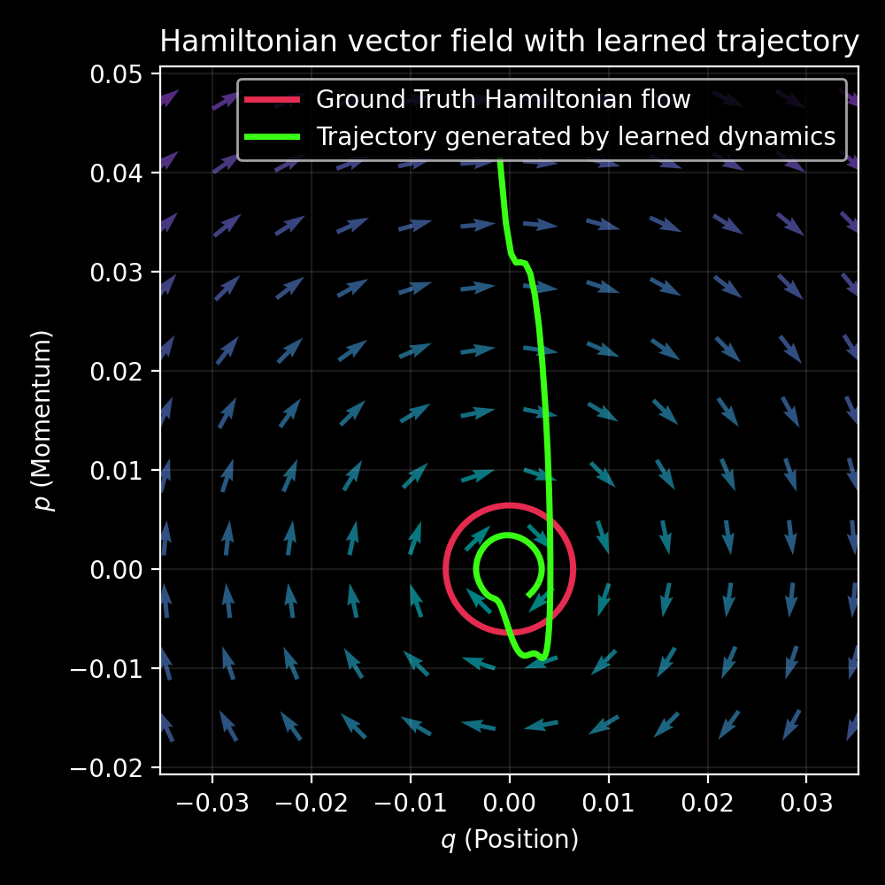

# Project 1 Figure Analysis

## Figure 1 - Training Curve

## Figure 2 - Position Trajectory

## Figure 3 - Hamiltonian Evolution

## Figure 4 - Phase Space Trajectory: Flow vs. Vectors

|                       **Hamiltonian Streamlines**                        | **Hamiltonian Vector Field** |
|:------------------------------------------------------------------------:|:----------------------------:|
|  |  |
