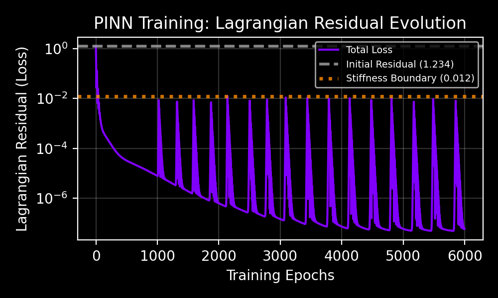
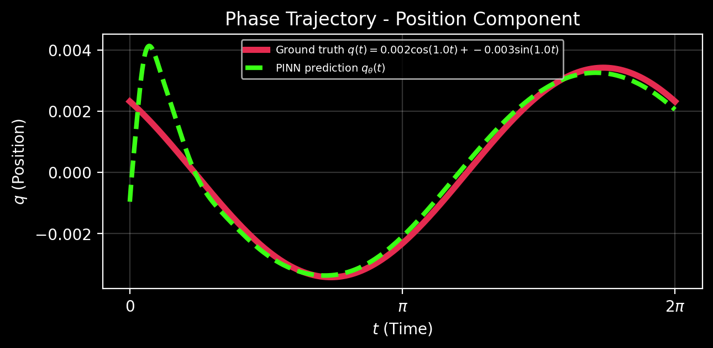
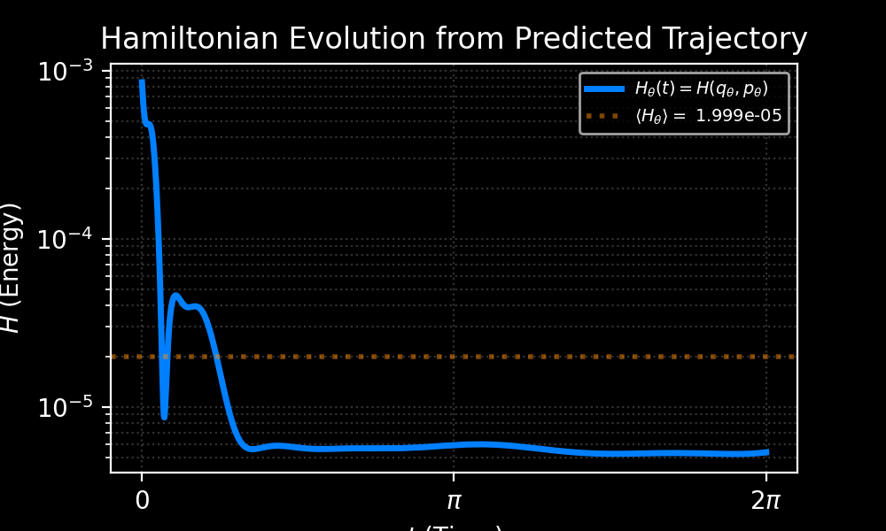
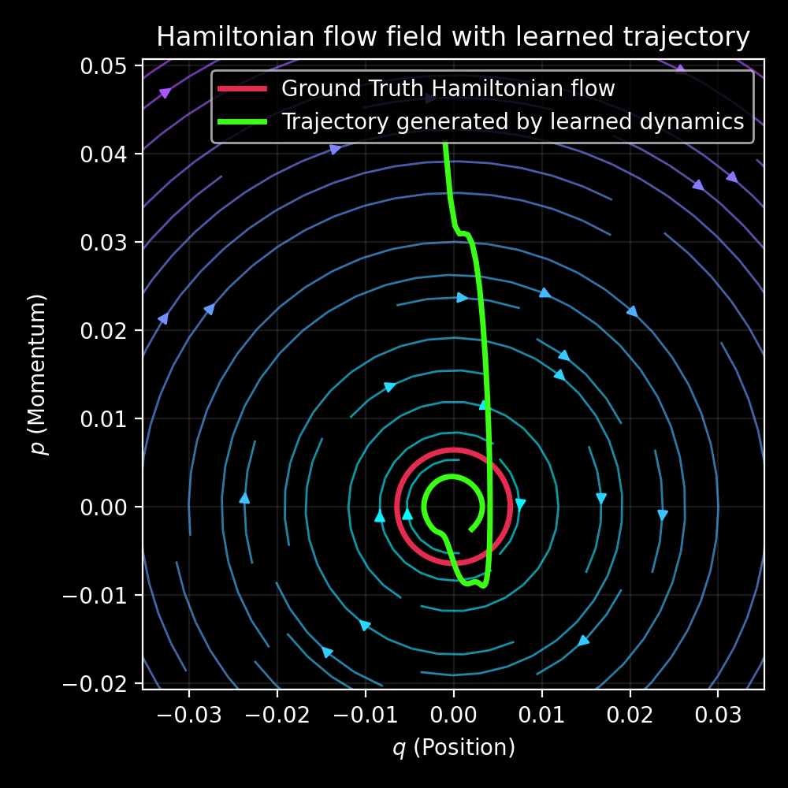
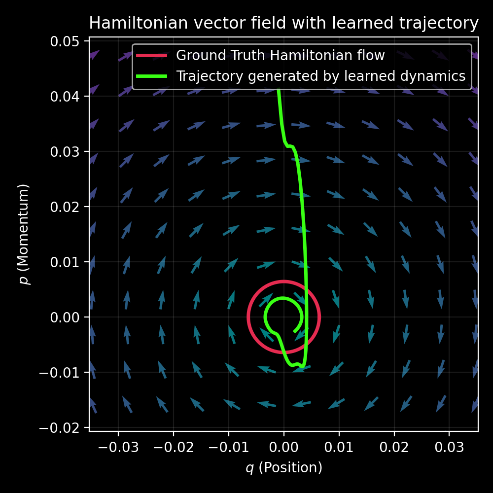

# Project 1 Figure Analysis

## Figure 1 - Training Curve

!!! eigenote "**Figure 1 Analysis**"

    !!! favicon "**Take-Home Message**"

        The training curve exhibits rapid initial descent followed by periodic spikes.

    ??? eigenote "🔑 Key Insights"
        
        - Early descent reflects the network's ability to quickly learn qualitative features rather than exact
          parameterization. This is followed with alternating regions of rapid descent, indicating
          constraint violations.

        - Spikes reflect transient conflicts between trajectory fitting and antisymmetric structure in the learned
          generator. This corresponds to the network re-learning its antisymmetric generator structure.

        - Interestingly, the spike amplitude remains approximately constant over training.

## Figure 2 - Position Trajectory

!!! eigenote "**Figure 2 Analysis**"

    The position component of the predicted trajectory $q_\theta(t)$ (green curve) and the ground truth trajectory
    $q(t)$ (red dashed curve).

    Note the use of canonical coordinates $q(t)=x(t)$ and $p(t)=\dot{x}(t)$, corresponding to the phase space of a 
    one-dimensional harmonic oscillator. Parameters are normalized so that the mass and sprink constant are implicitly
    absorbed into the natural frequency $\omega$.

## Figure 3 - Hamiltonian Evolution

!!! eigenote "**Figure 3 Analysis**"

    The **Hamiltonian generator** evaluated along the predicted trajectory:
    
    $$
    H_\theta(t) = H(q_\theta(t), p_\theta(t)) = \frac{1}{2}p^2_\theta (t) = \frac{1}{2}\omega^2q_\theta^2(t)
    $$

    !!! favicon "**Take-Home Message**"

        The learned dynamics produce a vector field increasingly tangent to the contours of $H$. From this emerges
        conservation enforced by the learned structure rather than just numeric accuracy.

    ??? eigenote "🔑 Key Insight"

        **Three Regions:**

            1. Sharp initial drop corresponds to the model discovering an approximate invariant.
            2. The small "bump" corresponds to rebalancing between the trajectory and structure losses.
            3. The final approximately flat region corresponds to near-stationary energy error.

## Figure 4 - Phase Space Trajectory: Flow vs. Vectors

|                       **Hamiltonian Streamlines**                        | **Hamiltonian Vector Field** |
|:------------------------------------------------------------------------:|:----------------------------:|
|  |  |

!!! eigenote "**Figure 4 Analysis**"

    1. **Left:** The analytic flow (blue streamlines) shows the global topology of the conservation law.
    2. **Right:** The vector field (quiver plot) shows the local direction of the symplectic flow generated by the
           ground-truth Hamiltonian generator.

    !!! favicon "**Take-Home Message**"
        1. **Analytic flow fields** (red curve) comes from (normalized) Hamilton's equations:

            $$
            \begin{align}
                \dot{q}(t) &= p(t) \\
                \dot{p}(t) &= -\omega^2 q(t)
            \end{align}
            $$

        2. **Learned PINN-trajectory** (green curve) comes from the learned dynamics.

    ??? eigenote "Aside on Variable Convention"

        - The predicted state in dynamical systems and PINNs is typically denoted as 
          $\mathbf{z_\theta}(t) = [q_\theta(t), p_\theta(t)]^T$. 
  
        - Using $\mathbf{z_\theta}$ (bold for vector) is considered best practice.

        

        

