# Project 2 Architecture

## Conceptual Overview

Project 2 employs a coupled physics-informed architecture that jointly learns:
$$
V_\theta(x) \, , \qquad \psi_n^\theta(x) \, , \qquad E_n^\theta \,.
$$

This results in a model that behaves as a constrained operator-learning system whose goal is to identify physically consistent Hamiltonian structure rather than simply interpolate observed data.

## Overall Architecture

```mermaid
%%{ init: {
        "theme": "base",
        "themeVariables": {
            "background": "#0D1117",
            "primaryColor": "#14B5FF",
            "primaryTextColor": "#F0F6FC",
            "primaryBorderColor": "#14B5FF",
            "lineColor": "#4CC9F0",
            "secondaryColor": "#0070EB",
            "tertiaryColor": "#0D1117",
            "fontFamily": "'Aclonica', sans-serif",
            "fontSize": "16px",
            "clusterBkg": "rgba(20, 181, 255, 0.02)",
            "clusterBorder": "#14B5FF",
            "edgeLabelBackground":"#0D1117",
            "nodeSpacing": 81,
            "rankSpacing": 131,
            "borderRadius": "16"
        },
        "themeCSS": ".node rect, .node circle, .node ellipse, .node polygon, .node path { stroke-width: 2.618px !important; filter: drop-shadow(0px 4px 6px rgba(0,0,0, 0.5)); } .node { filter: saturate(1.2) contrast(1.1); } .cluster rect { rx: 25.8; ry: 25.8; stroke-width: 1px; stroke-dasharray: 10,5; } .nodeLabel, .edgeLabel, .cluster-label, .label text, text { color: #F0F6FC !important; fill: #F0F6FC !important; font-weight: 300; } #PIML .cluster-label { fill: #00FFFF !important; font-size: 20px; } #PIML rect { stroke: #00E8FF; fill: rgba(0, 232, 255, 0.04); }",

        "flowchart": {
            "curve": "basis",
            "useMaxWidth": true,
            "htmlLabels": true,
            "rankSpacing": 131,
            "nodeSpacing": 81
        }
    }
}%%

flowchart TB

%% ==============================
%% COLOR CLASSES & STYLES
%% ==============================
%% Node colors preserved as requested, but with golden ratio radius (rx:16, ry:16)
style step0 fill:#2a071b,stroke:#FE28A2,color:#ffffff,stroke-width:2px,stroke-dasharray:6 6,rx:16,ry:16;
style step0 fill:#000000,stroke:#7952F5,stroke-width:4px,color:#FFF9D6,rx:16, ry:16;
style PIML fill:#0b1020,stroke:#00FFFF,stroke-width:4px,color:#ffffff,stroke-dasharray:6 6,rx:16, ry:16;
style potential fill:#11163a,stroke:#5f88ff,stroke-width:4px,color:#ffffff,rx:16, ry:16;
style neural_ansatz fill:#0d1a30,stroke:#3b82ff,stroke-width:3px,color:#ffffff,stroke-dasharray:6 6,rx:16, ry:16;
style energy_init fill:#1a233a,stroke:#3b82ff,stroke-width:2px,color:#ffffff,stroke-dasharray:5 5,rx:16,ry:16;
style energy_eigenvalues fill:#071320,stroke:#3b9eff,stroke-width:4px,color:#ffffff,stroke-dasharray:6 6,rx:16,ry:16;
style PINN fill:#131130,stroke:#7259ff,stroke-width:3px,color:#ffffff,stroke-dasharray:6 6,rx:16, ry:16;
style loss fill:#0a0f1a,stroke:#22d3ee,stroke-width:2px,color:#ffffff,stroke-dasharray:6 6,rx:16, ry:16;

classDef MLP fill:#2a185c,stroke:#9a66ff,stroke-width:4px,color:#ffffff,rx:16, ry:16;
classDef eigenfunctions fill:#153a55,stroke:#4ec9ff,stroke-width:2px,color:#ffffff,rx:16, ry:16;
classDef energy fill:#0d2238,stroke:#3b9eff,stroke-width:4px,color:#ffffff,rx:16, ry:16;
classDef loss_terms fill:#0b1326,stroke:#22d3ee,stroke-width:2px,color:#ffffff,rx:16, ry:16;

style synthetic_data fill:#010209,stroke:#5D3FD3,stroke-width:2px,stroke-dasharray:6 6,color:#ffffff,rx:16,ry:16;
style domain_norm fill:#0c0010,stroke:#750071,stroke-width:2px,color:#ffffff,rx:16,ry:16,stroke-dasharray:6 6;
style observed_data fill:#142034,stroke:#5280ff,stroke-width:2px,color:#ffffff,rx:16,ry:16;
style trap fill:#023e00,stroke:#57ffbc,color:#ffffff,stroke-width:2px,rx:16,ry:16;
style raw_wavefunctions fill:#224261,stroke:#14B5FF,stroke-width:2px,stroke-dasharray:6 6,color:#ffffff,rx:16,ry:16;
style normalization fill:#0f2335,stroke:#4b54ff,color:#ffffff,stroke-width:2px,stroke-dasharray:6 6,rx:16,ry:16;
style normalized_wavefunctions fill:#112230,color:#ffffff,stroke:#4b54ff,stroke-width:2px,stroke-dasharray:6 6,rx:16,ry:16;
style finite_difference fill:#011e00,stroke:#31ff48,color:#ffffff,stroke-width:2px,stroke-dasharray:6 6,rx:16,ry:16;
style residual fill:#0d2827,stroke:#03E8BD,stroke-width:2px,color:#ffffff,stroke-dasharray:6 6,rx:16,ry:16;
style diagnostics fill:#161b22,stroke:#FF66B3,stroke-dasharray:6 6,color:#ffffff,rx:16,ry:16;
style pod fill:#0d1b2a,stroke:#00d4ff,color:#ffffff,stroke-width:2px,stroke-dasharray:6 6,rx:16,ry:16;

classDef spatial_stencil fill:#2a0037,stroke:#750071,stroke-width:2px,color:#ffffff,rx:16,ry:16;
classDef norm fill:#1e2b4e,stroke:#4b54ff,color:#ffffff,stroke-width:2px,rx:16,ry:16;
classDef psiraw fill:#224261,stroke:#14B5FF,color:#ffffff,stroke-width:2px,rx:16,ry:16;
classDef psinorm fill:#224261,stroke:#4b54ff,stroke-width:2px,color:#ffffff,rx:16,ry:16;
classDef stencil fill:#023e00,stroke:#31ff48,color:#ffffff,stroke-width:2px,rx:16,ry:16;
classDef physics fill:#1c5654,stroke:#03E8BD,color:#ffffff,stroke-width:2px,rx:16,ry:16;
classDef opt fill:#2a071b,stroke:#FE28A2,color:#ffffff,stroke-width:2px,stroke-dasharray:6 6,rx:16,ry:16;
classDef diag fill:#2f1616,stroke:#FF66B3,stroke-width:2px,stroke-dasharray:6 6,rx:16,ry:16;

%% ==============================
%% NODES
%% ==============================
potential(("$$V_\theta$$"))

psi0_raw(("$$ \psi_0^\theta $$")):::psiraw
psi1_raw(("$$\psi_1^\theta$$")):::psiraw
psi2_raw(("$$\psi_2^\theta$$")):::psiraw

psi0(("$$\hat{\psi}_0^\theta$$")):::psinorm
psi1(("$$\hat{\psi}_1^\theta$$")):::psinorm
psi2(("$$\hat{\psi}_2^\theta$$")):::psinorm

E0(("$$E_0^\theta$$")):::energy
E1(("$$E_1^\theta$$")):::energy
E2(("$$E_2^\theta$$")):::energy

%% ==============================
%% PIPELINE
%% ==============================
subgraph PIML["PIML Framework"]
direction LR

    subgraph synthetic_data["1️⃣ Synthetic Data"]
    direction LR
        subgraph domain_norm["Uniform Grid"]
            spatial_grid["$$x\in[-5, 5]$$"]:::spatial_stencil
            deltax["$$\Delta x$$"]:::spatial_stencil
        end
        trap["Trapezoidal weights"]
        observed_data("$$\rho_n^\text{obs}, \ E_n^\text{obs}$$")
    end

    subgraph neural_ansatz["2️⃣ Neural Ansatz"]
    direction TB
        subgraph energy_init["Linear Energy Initialization"]
            E_init["$$E_n = \text{linspace}(0.5, n-0.5, n)$$"]:::energy
        end
        subgraph energy_eigenvalues["Energy Eigenvalues"]
            E0
            E1
            E2
        end
        E_init --> energy_eigenvalues

        subgraph PINN["2️⃣ PINN"]
        direction LR
            subgraph raw_wavefunctions["Raw Learned Wavefunctions"]
            direction TB
                psi0_raw
                psi1_raw
                psi2_raw
            end
            MLP1("MLP"):::MLP --> potential
            MLP2("MLP"):::MLP --> psi0_raw
            MLP3("MLP"):::MLP --> psi1_raw
            MLP4("MLP"):::MLP --> psi2_raw
        end
    end

    subgraph normalization["3️⃣A Orthonormalization"]
    direction TB
        apply_trapezoidal_weights["$$\int|\psi_n^\theta |^2 dx$$"]:::norm
        gs["GS+re-norm"]:::norm
        eps("$$+\epsilon \ \text{stability}$$"):::norm
    end

    subgraph normalized_wavefunctions["Normalized Wavefunctions"]
    direction TB
        psi0
        psi1
        psi2
    end

    subgraph finite_difference["3️⃣B Finite difference"]
    direction TB
        eigenfunction_stencil("$$\frac{\partial^2}{dx^2}\hat{\psi}_n^\theta$$"):::stencil
        potential_stencil("$$V_\theta''(x)$$"):::stencil
    end

    subgraph residual["4️⃣ Physics Residual"]
        direction LR
        R["$$R_n(x)=-\frac{1}{2}\nabla^2\hat{\psi} + (V-E)\hat{\psi}$$"]:::physics
    end
    style R stroke-width:5px;

    subgraph loss["5️⃣ Total Loss"]
    direction TB
        Lp["Physics loss"]:::loss_terms
        Ln["Order"]:::loss_terms
        Ls["Smoothness"]:::loss_terms
        Ld["Data mismatch"]:::loss_terms
    end

    opt["6️⃣ Optimizer (Adam)"]:::opt

    %% FLOW
    spatial_grid --> MLP1 & MLP2 & MLP3 & MLP4
    deltax & trap --> apply_trapezoidal_weights
    psi0_raw & psi1_raw & psi2_raw --> gs
    apply_trapezoidal_weights & eps --> gs
    gs --> psi0 & psi1 & psi2
    psi0 & psi1 & psi2 --> eigenfunction_stencil & R
    potential --> potential_stencil & R
    eigenfunction_stencil --> R
    E0 & E1 & E2 --> R & Ln & Ld
    R --> Lp
    potential & potential_stencil --> Ls
    psi0 & psi1 & psi2 --> Ls & Ld
    observed_data --> Ld
    Lp & Ln & Ls & Ld --> opt
    opt ==> MLP1
    opt ==> MLP2
    opt ==> MLP3
    opt ==> MLP4
    opt ==> E0
    opt ==> E1
    opt ==> E2
end

%% ==============================
%% DIAGNOSTICS
%% ==============================
subgraph diagnostics["7️⃣ Diagnostics"]
direction TB
    sanity["sanity checks"]:::diag
    pod["7️⃣ POD analysis"]:::pod
    sanity ~~~ pod
end

step0["0️⃣ Define TISE dynamics"]:::step0 --> PIML

psi0 & psi1 & psi2 --> sanity & pod
E0 & E1 & E2 --> sanity
potential --> sanity
deltax & trap --> pod

%% ==============================
%% LINKS
%% ==============================
linkStyle default stroke:#4CC9F0,stroke-width:1.618px,opacity:0.6

```

!!! eigenote "End-to-end PIML pipeline"

    The diagram illustrates the physics-informed machine learning pipeline for solving the Schrödinger equation implemented in project 2. 

    | Step #     | Descripition     |
    | :--------- | :--------------- |
    | 0️⃣ | Definition of the physical system (TISE).|
    | 1️⃣ | Synthetic data generation on a uniform grid with trapezoidal weights. |
    | 2️⃣ | Neual ansatz comprising MLPs for the potential $V_\theta$ and wavefunctions $\psi_n^\theta$, alongside trainable energy eigenvalues $E_n^\theta$. |
    | 3️⃣ | Wavefunction orthonormalization via Gram-Schmidt and finite-difference derivative calculation. |
    | 4️⃣ | Calculation of the physics residual $R_n(x)$ where the governing law is enforced. |
    | 5️⃣ | Total loss computation combining physics, smoothness, and data mismatch terms. |
    | 6️⃣ | Optimization via Adam, feeding back into the trainable parameters (thick arrows). |
    | 7️⃣ | Parallel analysis including sanity checks and POD. |

## POD Diagnostics

```mermaid
%%{ init: {
        "theme": "base",
        "themeVariables": {
            "background": "#0D1117",
            "primaryColor": "#14B5FF",
            "primaryTextColor": "#F0F6FC",
            "primaryBorderColor": "#14B5FF",
            "lineColor": "#4CC9F0",
            "secondaryColor": "#0070EB",
            "tertiaryColor": "#0D1117",
            "fontFamily": "'Aclonica', sans-serif",
            "fontSize": "16px",
            "clusterBkg": "rgba(20, 181, 255, 0.02)",
            "clusterBorder": "#14B5FF",
            "edgeLabelBackground":"#0D1117",
            "nodeSpacing": 81,
            "rankSpacing": 131,
            "borderRadius": "16"
        },
        "themeCSS": ".node rect, .node circle, .node ellipse, .node polygon, .node path { stroke-width: 2.618px !important; filter: drop-shadow(0px 4px 6px rgba(0,0,0, 0.5)); } .node { filter: saturate(1.2) contrast(1.1); } .cluster rect { rx: 25.8; ry: 25.8; stroke-width: 1px; stroke-dasharray: 10,5; } .nodeLabel, .edgeLabel, .cluster-label, .label text, text, .katex, .katex *, .MathJax, .MathJax *, mjx-container, mjx-container * { color: #F0F6FC !important; fill: #F0F6FC !important; font-weight: 300; } #pod .cluster-label { fill: #00D4FF !important; font-size: 20px; } #pod rect { stroke: #00D4FF; fill: rgba(0, 212, 255, 0.04); }",
        "flowchart": {
            "curve": "basis",
            "useMaxWidth": true,
            "htmlLabels": true,
            "rankSpacing": 131,
            "nodeSpacing": 81
        }
    } }%%

flowchart TB

%% ==============================
%% COLOR CLASSES (your palette)
%% ==============================
style synthetic_data fill:#010209,stroke:#5D3FD3,stroke-width:2px,stroke-dasharray:6 6,color:#ffffff,rx:16,ry:16;
style domain_norm fill:#0c0010,stroke:#ff00ff,stroke-width:2px,color:#ffffff,rx:16,ry:16,stroke-dasharray:6 6;
style pod fill:#0d1b2a,stroke:#00d4ff,color:#ffffff,stroke-width:2px,stroke-dasharray:6 6,rx:16,ry:16;
style trap fill:#002b11,stroke:#00ff88,color:#ffffff,stroke-width:2.5px,rx:16,ry:16;
style normalized_wavefunctions fill:#112230,color:#ffffff,stroke:#14B5FF,stroke-width:2px,stroke-dasharray:6 1,rx:16,ry:16;
style PsiMat fill:#112230,stroke:#14B5FF,color:#ffffff,stroke-width:2px,rx:16,ry:16;
style trap_pod fill:#1a1a1a,stroke:#ffcc00,stroke-width:3px,color:#ffffff,rx:16,ry:16,stroke-dasharray:8 2;
classDef spatial_modes fill:#2a185c,stroke:#9a66ff,stroke-width:4px,color:#ffffff,rx:16,ry:16;
classDef temporal_modes fill:#003333,stroke:#00ffcc,stroke-width:4px,color:#ffffff,rx:16,ry:16;
classDef spatial_stencil fill:#2a0037,stroke:#ff00ff,stroke-width:2px,color:#ffffff,rx:16,ry:16;
classDef psinorm fill:#002244,stroke:#14B5FF,stroke-width:2px,color:#ffffff,rx:16,ry:16;
classDef diag fill:#1a2b3c,stroke:#00e8ff,stroke-width:2.5px,rx:16,ry:16;

%% ==============================
%% INPUT BLOCKS
%% ==============================
    subgraph synthetic_data["1️⃣ Synthetic Data"]
    direction LR
        subgraph domain_norm["Uniform Grid"]
            spatial_grid["$$x\in[-5, 5]$$"]:::spatial_stencil
            deltax["$$\Delta x$$"]:::spatial_stencil
        end
        trap["Trapezoidal weights"]
    end

subgraph normalized_wavefunctions["Normalized Wavefunctions"]
    direction TB
    psi0(("$$\hat{\psi}_0^\theta$$")):::psinorm
    psi1(("$$\hat{\psi}_1^\theta$$")):::psinorm
    psi2(("$$\hat{\psi}_2^\theta$$")):::psinorm
end


%% ==============================
%% POD DIAGRAM
%% ==============================
subgraph pod["7️⃣ POD analysis"]
    PsiMat("Snapshot matrix construction<br/>$$\mathbf{\Psi}^\theta = [\hat{\psi}_0, \hat{\psi}_1, \hat{\psi}_2]$$")
    trap_pod("L² spatial weighting<br/>$$\mathbf{\Psi}_w = \sqrt{w \Delta x} \odot \mathbf{\Psi}$$")
    SVD("Euclidean SVD<br/>$$\mathbf{\Psi}_w = U \Sigma V^T$$"):::diag
    podscale("Physical mode recovery<br/>$$u_k^\text{phys} = u_k / \sqrt{w \Delta x}$$"):::spatial_modes
    align("Phase/Sign Alignment<br/>(Relative to Ground Truth)"):::spatial_modes
    spec("Singular values spectrum $$\sigma_k$$"):::diag
    modes("Physical Basis Functions $$u_k^\text{phys}$$"):::spatial_modes
    overlaps("Overlap matrix $$C_{kn}$$<br/>$$\langle u_k^\text{phys}, \hat{\psi}_n \rangle$$"):::spatial_modes
    temporal_scaling("Temporal mode projection from $$V^T$$"):::temporal_modes
    temporal_alignment("Global U(1) Phase Alignment"):::temporal_modes
    temporal_mode_heatmap("Composition Heatmap (Matrix $$V_{nk}$$)"):::temporal_modes
    temporal_overlap("Orthogonality Check $$\langle v_m, v_n \rangle = \delta_{mn}$$"):::temporal_modes
    cross_temporal("Cross-State Projections $$|\langle \mathbf{e}_n, v_k \rangle|$$"):::temporal_modes

    %% POD Companion Panels
    PsiMat --> trap_pod
    trap_pod --> SVD
    SVD --> spec
    SVD --> podscale
    SVD --> temporal_scaling
    podscale --> align
    align --> modes
    PsiMat --> overlaps

    temporal_scaling --> temporal_alignment
    temporal_alignment --> temporal_mode_heatmap
    temporal_alignment --> temporal_overlap
    temporal_alignment --> cross_temporal
    PsiMat --> cross_temporal
end

%% ==============================
%% CONNECTIONS
%% ==============================
psi0 --> PsiMat
psi1 --> PsiMat
psi2 --> PsiMat

deltax --> trap_pod
trap --> trap_pod

%% ==============================
%% LINKS (subtle)
%% ==============================
linkStyle default stroke:#4CC9F0,stroke-width:1.618px,opacity:0.6
```

!!! eigenote "Proper Orthogonal Decomposition (POD) Diagnostics"
  
    This figure details the weighted POD pipeline used for diagnostic verification.
 
    - **Snapshot Matrix**: Formed from normalized wavefunctions.
    - **Weighting**: Scaling with $\sqrt{w_i \Delta x}$ ensures the L2 inner product maps to a Euclidean dot product for SVD.
    - **Physical Scaling**: Rescaling SVD modes back to physical space.
    - **Overlaps**: Calculation of the overlap matrix $C_{kn}$ to assess mode orthogonality and alignment with learned states.

    - [x] Write the mathematical expression for the inner product with the subscripts used. 

    $$\langle f, g \rangle_{\Delta x, w} = \sum_i w_i f(x_i)^* g(x_i) \Delta x$$