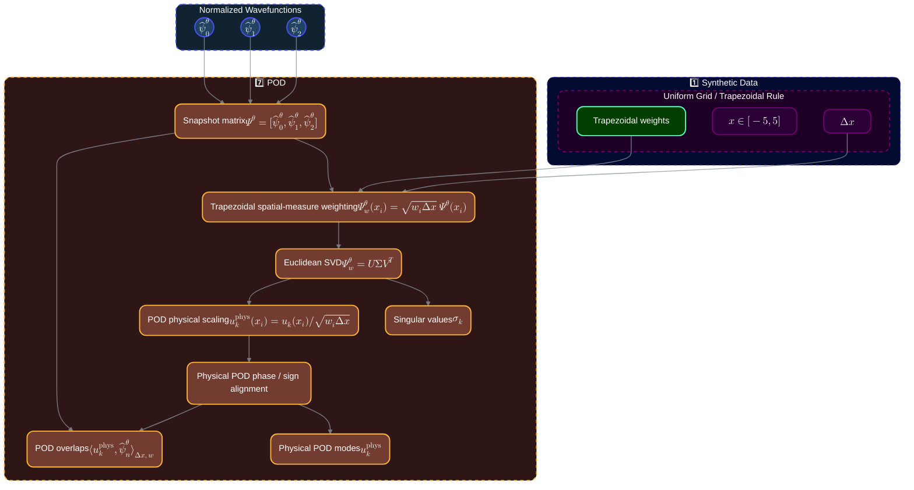

# Project 2 Architecture

## Overall Architecture

```mermaid
%%====================================================================
%%  Final Architecture Diagram
%%====================================================================
%%{ init: {
        "theme": "base",
        "themeVariables": {
            "background": "#0D1117",
            "lineColor": "#14B5FF",
            "fontFamily": "'Aclonica', sans-serif",
            "borderRadius": "16"
        },
        "themeCSS": ".nodeLabel, .edgeLabel, .cluster-label, .cluster-label text, .label, .label text, text, .katex, .katex *, .MathJax, .MathJax *, mjx-container, mjx-container * { color: whitesmoke !important; fill: whitesmoke !important; -webkit-text-fill-color: whitesmoke !important; }",
        "flowchart": {
            "curve": "basis",
            "nodeSpacing": 30,
            "rankSpacing": 50
        },
        "handDrawn": true
    }
}%%
%%====================================================================

flowchart TB

%% ==============================
%% COLOR CLASSES & STYLES
%% ==============================

%% Styles from architecture_darker_background_no_normalization.mmd
style step0 fill:#0f0a25,stroke:#7c5cff,stroke-width:4px,color:#ffffff,rx:12px, ry:12px;
style PIML fill:#0b1020,stroke:#5a6cff,stroke-width:4px,color:#ffffff,stroke-dasharray:6 6,rx:12px, ry:12px;
style potential fill:#11163a,stroke:#5f88ff,stroke-width:4px,color:#ffffff,rx:12px, ry:12px;
style neural_ansatz fill:#0d1a30,stroke:#3b82ff,stroke-width:3px,color:#ffffff,stroke-dasharray:6 6,rx:12px, ry:12px;
style energy_init fill:#1a233a,stroke:#3b82ff,stroke-width:2px,color:#ffffff,stroke-dasharray:5 5,rx:12px,ry:12px;
style energy_eigenvalues fill:#071320,stroke:#3b9eff,stroke-width:4px,color:#ffffff,stroke-dasharray: 6 6, rx:12px, ry:12px;
style PINN fill:#131130,stroke:#7259ff,stroke-width:3px,color:#ffffff,stroke-dasharray:6 6,rx:12px, ry:12px;
style loss fill:#0a0f1a,stroke:#22d3ee,stroke-width:2px,color:#ffffff,stroke-dasharray:6 6,rx:12px, ry:12px;

classDef MLP fill:#2a185c,stroke:#9a66ff,stroke-width:4px,color:#ffffff,rx:12px, ry:12px;
classDef eigenfunctions fill:#153a55,stroke:#4ec9ff,stroke-width:2px,color:#ffffff,rx:12px, ry:12px;
classDef energy fill:#0d2238,stroke:#3b9eff,stroke-width:4px,color:#ffffff,rx:12px, ry:12px;
classDef loss_terms fill:#0b1326,stroke:#22d3ee,stroke-width:2px,color:#ffffff,rx:12px, ry:12px;

%% Styles from architecture_normalization.mmd (for normalization elements)
style synthetic_data fill:#040b30,stroke:#5D3FD3,stroke-dasharray:6 6,color:#ffffff,rx:12,ry:12;
style domain_norm fill:#1E0026,stroke:#750071,stroke-width:2px,color:#ffffff,rx:12,ry:12,stroke-dasharray:6 6,rx:12,ry:12;
style observed_data fill:#142034,stroke:#5280ff,stroke-width:2px,color:#ffffff,rx:12,ry:12;
style trap fill:#023e00,stroke:#57ffbc,color:#ffffff,stroke-width:2px,rx:12,ry:12;
style raw_wavefunctions fill:#224261,stroke:#14B5FF,stroke-width:2px,stroke-dasharray:6 6,color:#ffffff,rx:12,ry:12;
style normalization fill:#0f2335,stroke:#4b54ff,color:#ffffff,stroke-width:2px, stroke-dasharray: 6 6, rx:12, ry:12;
style normalized_wavefunctions fill:#112230,color:#ffffff,stroke:#4b54ff,stroke-width:2px,stroke-dasharray:6 6,rx:12,ry:12;
style finite_difference fill:#011e00,stroke:#31ff48,color:#ffffff,stroke-width:2px,stroke-dasharray:6 6,rx:12,ry:12;
style residual fill:#0d2827,stroke:#03E8BD,stroke-width:2px,color:#ffffff,stroke-dasharray:6 6,rx:12px,ry:12px;
style diagnostics fill:#161b22,stroke:#f68080,stroke-dasharray:6 6,color:#ffffff,rx:12,ry:12;
style pod fill:#2f1616,stroke:#FEB538,color:#ffffff,stroke-width:2px,stroke-dasharray:6 6,rx:12px,ry:12px;

classDef spatial_stencil fill:#2a0037,stroke:#750071,stroke-width:2px,color:#ffffff,rx:12,ry:12;
classDef norm fill:#1e2b4e,stroke:#4b54ff,color:#ffffff,stroke-width:2px,rx:12px,ry:12px;
classDef psiraw fill:#224261,stroke:#14B5FF,color:#ffffff,stroke-width:2px,rx:12,ry:12;
classDef psinorm fill:#224261,stroke:#4b54ff,stroke-width:2px,color:#ffffff,rx:12,ry:12;
classDef stencil fill:#023e00,stroke:#31ff48,color:#ffffff,stroke-width:2px,rx:12,ry:12;
classDef physics fill:#1c5654,stroke:#03E8BD,color:#ffffff,stroke-width:2px,rx:12,ry:12;
classDef opt fill:#2a071b,stroke:#FE28A2,color:#ffffff,stroke-width:2px,stroke-dasharray:6 6,rx:12,ry:12;
classDef diag fill:#723c30,stroke:#FEB538,color:#ffffff,stroke-width:2px,rx:12,ry:12;

%% ==============================
%% NODES (Information from architecture_2_normalization_and_diagnostics.mmd)
%% ==============================
potential(("$$V_\theta$$"))

psi0_raw(("$$\psi_0^\theta$$")):::psiraw
psi1_raw(("$$\psi_1^\theta$$")):::psiraw
psi2_raw(("$$\psi_2^\theta$$")):::psiraw

psi0(("$$\hat{\psi}_0^\theta$$")):::psinorm
psi1(("$$\hat{\psi}_1^\theta$$")):::psinorm
psi2(("$$\hat{\psi}_2^\theta$$")):::psinorm

E0(("$$E_0^\theta$$")):::energy
E1(("$$E_1^\theta$$")):::energy
E2(("$$E_2^\theta$$")):::energy

%% ==============================
%% PIPELINE
%% ==============================
subgraph PIML["PIML Framework"]
direction LR

    subgraph synthetic_data["1️⃣ Synthetic Data"]
    direction TB
        subgraph domain_norm["Uniform Grid / Trapezoidal Rule"]
            spatial_grid["$$x\in[-5, 5]$$"]:::spatial_stencil
            deltax["$$\Delta x$$"]:::spatial_stencil
            trap["Trapezoidal weights"]
        end

        observed_data("$$\rho_n^\text{obs}, \ E_n^\text{obs}$$")
    end

    subgraph neural_ansatz["2️⃣ Neural Ansatz"]
    direction TB
        subgraph energy_init["Linear Energy Initialization"]
            E_init["$$E_n = \text{linspace}(0.5, n-0.5, n)$$"]:::energy
        end

        subgraph energy_eigenvalues["Energy Eigenvalues"]
            E0
            E1
            E2
        end

        E_init --> energy_eigenvalues

        subgraph PINN["2️⃣ PINN"]
        direction TB

            subgraph raw_wavefunctions["Raw Learned Wavefunctions"]
            direction TB
                psi0_raw
                psi1_raw
                psi2_raw
            end

            MLP1("MLP"):::MLP --> potential
            MLP2("MLP"):::MLP --> psi0_raw
            MLP3("MLP"):::MLP --> psi1_raw
            MLP4("MLP"):::MLP --> psi2_raw
        end
    end

    subgraph normalization["3️⃣ Wavefunction Normalization / Orthonormalization"]
    direction LR
        apply_trapezoidal_weights["$$\int|\psi_n^\theta |^2\, dx=\sum{w_i |\psi_n^\theta |^2 \Delta x}$$"]:::norm
        norm1("Per-state L2 Normalize"):::norm
        gs["Sequential Gram-Schmidt<br/>and re-normalize"]:::norm
        eps("$$+\epsilon \ \text{stability}$$"):::norm
    end

    subgraph normalized_wavefunctions["Normalized Wavefunctions"]
    direction TB
        psi0
        psi1
        psi2
    end

    subgraph finite_difference["3️⃣ Finite difference"]
    direction LR
        eigenfunction_stencil("$$\frac{\partial^2}{dx^2}\psi_n^\theta$$ via"):::stencil
        potential_stencil("$$V_\theta''(x)$$"):::stencil
    end

    subgraph residual["4️⃣ Physics Residual"]
    direction LR
        H("Ĥψ"):::physics
        R["$$R_n(x)=-\frac{1}{2}\frac{\partial^2}{\partial x^2}\psi_n^\theta + V_\theta\psi_n^\theta-E_n^\theta\psi_n^\theta $$"]:::physics
    end

    subgraph loss["5️⃣  Total Loss"]
        Lp["Physics loss"]:::loss_terms
        Ln["Order"]:::loss_terms
        Ls["Smoothness"]:::loss_terms
        Ld["Data mismatch"]:::loss_terms
    end

    opt["6️⃣  Optimizer (Adam)"]:::opt

    %% FLOW
    spatial_grid --> MLP1
    spatial_grid --> MLP2
    spatial_grid --> MLP3
    spatial_grid --> MLP4

    deltax --> apply_trapezoidal_weights
    trap --> apply_trapezoidal_weights

    psi0_raw --> norm1
    psi1_raw --> norm1
    psi2_raw --> norm1

    apply_trapezoidal_weights --> norm1

    eps --> norm1

    norm1 --> gs

    gs --> psi0
    gs --> psi1
    gs --> psi2


    psi0 --> eigenfunction_stencil
    psi1 --> eigenfunction_stencil
    psi2 --> eigenfunction_stencil

    potential --> potential_stencil

    eigenfunction_stencil --> H
    potential --> H
    E0 --> H
    E1 --> H
    E2 --> H

    H --> R --> Lp

    E0 --> Ln
    E1 --> Ln
    E2 --> Ln

    potential --> Ls
    potential_stencil --> Ls

    psi0 --> Ld
    psi1 --> Ld
    psi2 --> Ld
    E0 --> Ld
    E1 --> Ld
    E2 --> Ld
    observed_data --> Ld

    Lp --> opt
    Ln --> opt
    Ls --> opt
    Ld --> opt

    opt --> MLP1
    opt --> MLP2
    opt --> MLP3
    opt --> MLP4
    opt --> E0
    opt --> E1
    opt --> E2

end

%% ==============================
%% DIAGNOSTICS
%% ==============================
    subgraph diagnostics["Diagnostics"]
direction TB

    sanity["sanity checks"]:::diag
    
    pod["7️⃣ POD analysis"]:::pod

    sanity ~~~ pod

    deltax --> pod
    trap --> pod

end

step0["0️⃣ Define TISE dynamics"] --> PIML

psi0 --> sanity
psi0 --> pod
psi1 --> sanity
psi1 --> pod
psi2 --> sanity
psi2 --> pod

E0 --> sanity
E1 --> sanity
E2 --> sanity

potential --> sanity

%% ==============================
%% LINKS (subtle)
%% ==============================
linkStyle default stroke:#8b949e,stroke-width:1.5px,opacity:0.8
```

## POD Diagnostics

!!! note "__Notes on POD Analysis__"

    - SVD modes are sign-ambiguous and Euclidean-normalized. Thus, physical POD modes $u_k$ require trapezoidal $w_i\Delta x$ scaling. The modes evaluatedi in the analysis are denoted $u_k^\text{phys}$.
    - POD phase / sign alignment occurs after POD scaling.
    - [ ] Write the mathematical expression for the inner product with the subscripts used.