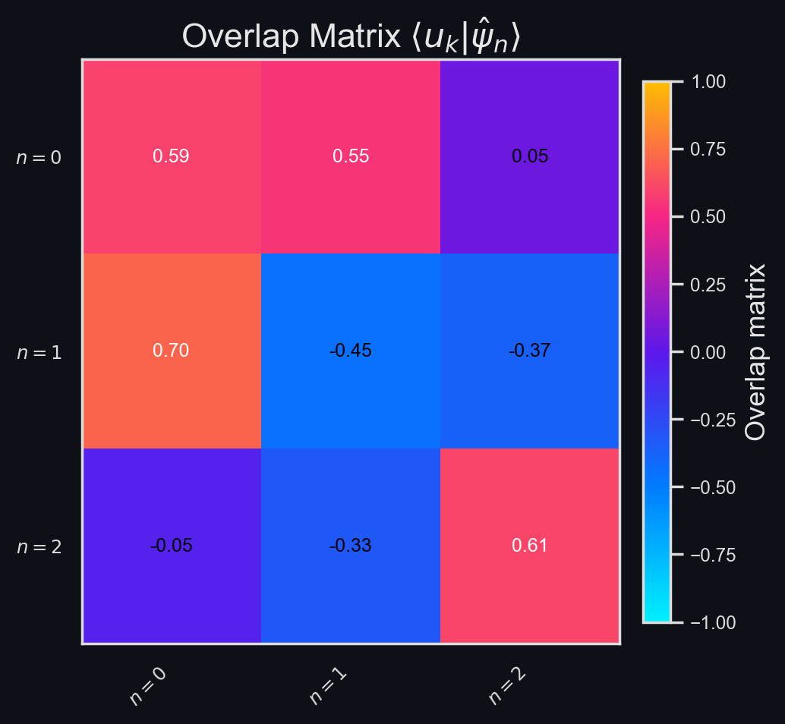

# Figure Analysis (Windows)

## Figure 1 - Training Curves
---

!!! eigenote "**Figure 1 Analysis**"

    !!! favicon "**Take-Home Message**"
    
        The optimizer exhibits three distinct regime transitions before settling on a stable plateau.

    ??? eigenote "🔑 Key Insights"
        
        1. **Spike 1 ($\approx$ 0-50 epochs)** - Expected transient while the network adjusts from random initial weights.
        2. **Spike 2 ($\approx$ 800 epochs)** - Discovery of a higher-curvature potential: smoothness and total loss spike, physics and data terms rise only moderately.
        3. **Spike 3 ($\approx$ 2000 epochs)** - Order-of-magnitude jump in the smootheness term propagates into the physics loss; a new plateau follows with lower smothness fidelity, but improved data fit.
        
    ??? fail "❌ **Failure Modes**"
        
        | **Verdict** | **Failure Mode** | **Description** | **Explanation** |
        | :---------- | :--------------- | :-------------- | :-------------- |
        | ❌ | High final loss | Optimizer stalls in a local minimum. | Total loss remains greater than 1e-1 at epoch 6000. |
        | ✔️ | Oscillation avoided | Unbalanced loss weights can cause loss terms to oscillate. | Curves converge monotonically after Spike 3. |
        | ❌ | Physics collapse | Data loss decreases, while TISE residual increases. | Indicates operator inconsistency. |
        | ❌ | Over-regularization | Smoothness term dominates, spectrum becomes innacurate. | Post-Spike 3 plateau shows $\lambda_\text{smooth}$ is much greater than others. | 

## Sanity Checks
---

### Figure 2 - $V_\theta$ vs. $V(x)$

!!! eigenote "**Figure 2 Analysis**"

    !!! favicon "**Take-Home Message**"

        The learned potential $V_\theta(x)$ (sigmoidal) differs markedly from the harmonic ground truth $V(x)=\tfrac12 x^2$.

    ??? eigenote "🔑 Key Insights"

        1. Central regions of the learned eigenfunctions (Fig. 3) and densities (Fig. 5) match the ground truth far better than the tails.
        2. The model learns only the portion of $H_\theta$ required to reproduce high-probability regions, exposing the inverse problem's under-determinism.

    ??? fail "❌ **Failure Modes**"

        | **Verdict** | **Failure Mode**              | **Description**                                                                          | **Explanation**                                                    |
        |:------------|:------------------------------|:-----------------------------------------------------------------------------------------|:-------------------------------------------------------------------|
        | ❌           | Gemoetric mismatch       | Learned $V_\theta$ shape incompatible with true quadratic.                               | Central well too narrow; tails saturate at $V_\theta \approx \pm 12 $. |
        | ❌           | Boundary under-constraint | Sparse data at $x \in (-\infty, -4.5] \cup [4.5, \infty)$ allows the potential to drift. | Grey dashed domain limits show no training points beyond. |

### Figure 3 – $\{\psi_n^\theta\}$ vs. $\{\psi_n\}$

!!! eigenote "**Figure 3 Analysis**"

    !!! favicon "**Take-Home Message**"

        Learned eigenfunctions $\psi_n^\theta(x)$ capture the nodal pattern but diverge in low-amplitude tail regions.

    ??? eigenote "🔑 Key Insights"

        1. **Phase matching** - Correct nodal count confirms energy ordering.
        2. **Central accuracy** - Highest fidelity occurs where $|\psi_n|^2$ is largest.
        3. **Tail divergence** - For $x \in (-4.5, -2] \cup [2, 4.5)$, the learned curves overshoot, reflecting data scarcity.

    ??? fail "❌ Failure Modes"

        | **Verdict** | **Failure Mode** | **Description** | **Explanation**                            |
        | :---------- | :--------------- | :-------------- |:-------------------------------------------|
        | ❌ | Nodal mis-count | Extra nodes appear beyond $x \approx \pm 3$) | Indicates spectral leakage.                |
        | ✔️ | Sign / parity flip | Unaligned solutions may invert parity | Sign aligned; parity matches ground truth. |
        | ❌ | Spurious oscillations | High-frequency ripples in tails from weak $V_\theta$ smoothness. | Visible beyond $x\approx \pm 4$.           |

### Figure 4 – $\{E_n^\theta\}$ vs. $\{E_n\}$

!!! eigenote "**Figure 4 Analysis**"

    !!! favicon "**Take-Home Message**"

        Learned energies $E_n^\theta$ follow the harmonic spectrum $E_n=n+\tfrac12$ and match observations within 5 %.

    ??? eigenote "__🔑 **Key Insights**__"
    
        1. Correct ordering suggests $\mathcal{L}_\text{order}$ is effective.
        2. Spectrum remains stable despite 2z% Gaussian noise in training data.
    
    ??? fail "__❌ **Failure Modes**__"
    
        | **Verdict** | **Failure Mode** | **Description** | **Explanation** |
        | :---------- | :--------------- | :-------------- | :-------------- |
        | ❌ | Spectral fit, wrong operator | Energies match, but $V_\theta$ deviates (see Fig. 2) |

### Figure 5 - $\{|\psi_n^\theta|^2\}$ vs.$\{\rho_n^\text{observed}\}$

!!! eigenote "Figure 5 Analysis"

    !!! favicon "**Take-Home Message**"
    
        Learned densities, $\rho_n^\theta = |\psi_n^\theta|^2$ agree with 2%-noise observations.
    
    ??? eigenote "__🔑 **Key Insights**__"
    
        1. **Noise filtering** - PINN acts as a physics-informed smoother.
        2. **Data dominance** - Good density fit persists even with incorrect potential (Fig. 2), confirming $\mathcal{L}_\text{data}$ is easy to minimize.
    
    ??? fail "❌ **Failure Modes**"
    
        | **Verdict** | **Failure Mode** | **Description** | **Explanation** |
        | :---------- | :--------------- | :-------------- | :-------------- |
        | ✔️ | Peak flattening | Excessive $\lambda_\text{smooth}$ can lower peaks | Peaks are preserved $\Rightarrow$ smoothing is well-tuned. |
        | ✔️ | Mode merging | Energy mis-ordering can collapse multiple states onto one density. |

## POD Analysis

### Figure 6 - POD Singular Values

!!! eigenote "Figure 6 Analysis"

    !!! favicon "**Take-Home Message**"

        Singular values from the POD of the learned wavefunction matrix decrease (log scale) from $\approx 1$.

    ??? eigenote "🔑 **Key Insights**"
    
        1. **Rank efficiency** - Rapid two-decade decay indicates a low-dimensional basis.
        2. **Basis conditioning** - Separation between $\sigma_0$, $\sigma_1$, and $\sigma_2$ quantifies how much "physics" each node carries.
    
    ??? fail "❌ **Failure Modes**"
    
        | **Verdict** | **Failure Mode** | **Description** | **Explanation**                                            |
        | :---------- | :--------------- | :-------------- |:-----------------------------------------------------------|
        | ❌ | Flat spectrum | All $\sigma_i$ nearly equal $\Rightarrow$ modes are independent, but unphysical. | Would signal noise-dominated snapshots (❓).                |
        | ❌ | Slow decay | $\tfrac{\sigma_{2}}{\sigma_{0}} \geq 0.3 \Rightarrow$ redundant or correlated modes. | Implies over-fitting or aliasing in $\hat{\psi}_n^\theta$. |
    
### Figure 7 - Overlap matrix $\langle \hat{\psi}_m^\theta | \hat{\psi}_n^\theta \rangle $

!!! eigenote "Figure 7 Analysis"

    !!! favicon "**Take-Home Message**"
        
        Overlap matrix $\langle \hat{\psi}_i^\theta | \hat{\psi}_j^\theta \rangle$ confirms orthogonality of learned eigenfunctions.
    
    ??? "🔑 **Key Insights**"
        
        1. **Orthogonality:** - Diagonals are $\approx 1$, off-diagonals are $\approx 0$ confirms Hermitian structure.
        2. **Basis consistency** - Any bright off-diagonal would expose weak $\mathcal{L}_\text{physics}$.
    
    ??? fail "❌ **Failure Modes**"
    
        | **Verdict** | **Failure Mode** | **Description** | **Explanation** |
        | :---------- | :--------------- | :-------------- | :-------------- |
        | ✔️ | Non-orthogonality | Off-diagonal $> 0.1$ indicates incomplete convergence | Here, max off-diagonal is $\ge 0.02$ $\Rightarrow$ passes. | 

### Figure 8 - $\{u_n\}$ vs. $\{\hat{\psi}_n^\theta\}$ vs. $\{\hat{\psi}_n\}$

!!! eigenote "Figure 8 Analysis"

    !!! favicon "**Take-Home Message**"

        First three POD modes (blue) compared with learned $\hat{\psi}_i^\theta$ (green) and ground truth $\hat{\psi}_i$ (red).

    ??? eigenote "🔑 **Key Insights**"
    
        1. **Geometric structure** – Similarity to $\hat{\psi}_n$ indicates a stable, data-driven basis.
        2. **Feature extraction** - POD isolates the most persistent spatial patterns.
    
    ??? fail "❌ **Failure Modes**"
    
        | **Verdict** | **Failure Mode** | **Description** | **Explanation** |
        | :---------- | :--------------- | :-------------- | :-------------- |
        | ❌ | Mode mixing | Pod modes do not resemble any physical eigenfunction. | Blue curves visibly shifted (see Sec. A.6); fix requires re-weighting. |

### Figure 9 - Overlap matrix $\langle u_k | \hat{\psi}_n^\theta \rangle$

!!! eigenote "Figure 9 Analysis"

    !!! favicon "**Take-Home Message**"
    
        Overlaps $\langle u_k | \hat{\psi}_n^\theta \rangle$ between POD spatial modes and learned wavefunctions.
    
    ??? eigenote "🔑 **Key Insights**"
    
        1. **Alignment** - Ideal result is $\pm$ identity; here large off-diagonals show mis-alignment.
        2. **Energy concentration** – Color magnitude reveals how energy distributes across modes.
    
    ??? fail "❌ **Failure Modes**"
    
        | **Verdict** | **Failure Mode** | **Description**                                           | **Explanation** |
        | :---------- | :--------------- |:----------------------------------------------------------| :-------------- |
        | ❌ | Distributed overlap | Single $u_k$ projects onto several $\hat{\psi}_n^\theta$. | 🔮 Further investigation required to understand the root cause and impact on POD basis stability and interpretability. |

### Figure 10 - Overlap matrix $\langle u_k | \hat{\psi}_n \rangle$ 

!!! eigenote "Figure 10 Analysis"

    !!! favicon "**Take-Home Message**"
    
        Cross-overlap $\langle u_k | \hat{\psi}_n\rangle$ between physical POD modes and analytic ground-truth eigenfunctions.
    
    ??? eigenote "🔑 **Key Insights**"
    
        1. **Absolute consistency** - High diagonal elements validate that the POD basis can recover the true physical basis.
        2. **Spectral recovery** - Confirms operator structure even when $V_\theta$ differs.    
    
    ??? fail "❌ **Failure Modes**"

        | **Verdict** | **Failure Mode** | **Description** | **Explanation** |
        | :---------- | :--------------- | :-------------- | :-------------- |
        | ❌ | Mis-alignment | Off-diagonal $> 0.2$ indicates POD not yet physical | Here $\rangle u_0, \hat{\psi}_1 \rangle \approx 0.3 \Rightarrow $ Fix via rescaling (see text). 

### Figure 11 - Temporal Modes

!!! eigenote "Figure 11 Analysis"

    !!! favicon "**Take-Home Message**"
    
        Columns of $V$ from $\Psi=U\Sigma V^T$: modal composition per state.
    
    ??? eigenote "🔑 **Key Insights**"
    
        1. **Coefficient distribution** - Shows how each POD mode contributes to each learned state.
    
    ??? fail "❌ **Failure Modes**"
    
        | **Verdict** | **Failure Mode** | **Description** | **Explanation** |
        | :---------- | :--------------- | :-------------- | :-------------- |
        | ❌ | Incoherent coefficients | Random sign / magnitude pattern across rows of $V$. | Magnitudes scatter (cf. Fig. 13) $\Rightarrow$ indicates prior mis-alignment. |

### Figure 12 - Overlap Matrix $\langle v_m | v_n \rangle$

!!! eigenote "Figure 12 Analysis"

    !!! favicon "Take-Home Message"
    
        Overlap $\langle v_m | v_n \rangle  \approx I$, as expected.
    
    ??? eigenote "🔑 **Key Insights**"
    
        1. **Unitary property** - Diagonals $\approx 1$, off-diagonals $\approx 0$ verifies numerical stability of SVD.
    
    ??? fail "❌ **Failure Modes**"
    
        | **Verdict** | **Failure Mode** | **Description**                                                                                  | **Explanation**                                                                                |
        | :---------- | :--------------- |:-------------------------------------------------------------------------------------------------|:-----------------------------------------------------------------------------------------------|
        | ✔️ | Identity deviation | Large off-diagonals | Largest off-diagonal $\approx 3\times 10^{-3} \Rightarrow$ within tolerance $\therefore$ pass. |

### Figure 13 - Overlap Matrix $|\langle \mathbf{e}_n | v_n \rangle|$

!!! eigenote "Figure 13 Analysis"

    !!! favicon "Take-Home Message"

        Absolute coefficients $|V_{nk}| = |\langle \mathbf{e}_n | v_k \rangle|$ (basis vector vs. temporal mode).

    ??? eigenote "🔑 **Key Insights**"

        1. **Modal dominance** - Ideally sparse with a bright diagonal; here large off-diagonals repeat the spatial misalignment story.

    ??? fail "❌ **Failure Modes**"
    
        | **Verdict** | **Failure Mode** | **Description** | **Explanation** |
        | :---------- | :--------------- | :-------------- | :-------------- |
        | ❌ | Spread dominance | No clear diagonal; each state draws from several $v_k$. | Reflects same weighting bug; correcting $\psi_n^\theta$-scaling collapses to identity. | 