# Figure Analysis (macOS)
---

!!! eigenote "Figures 1 a-c - Training Curves"

    === "**Figure 1a - Full Simulation**"

        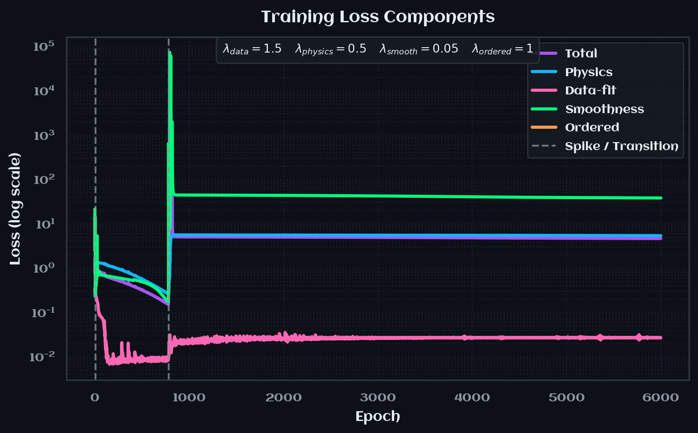

    === "**Figures 1b-c - Zoomed-In Simulation Windows**"

        |**Figure 1b - Spike 1**|**Figure 1c - Spike 2**| 
        |:---------------------:|:---------------------:|
        |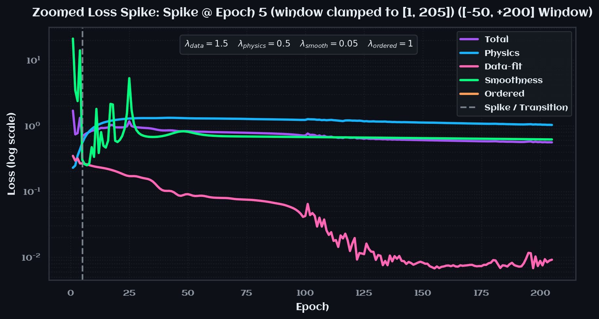||

    !!! favicon "**Take-Home Message**"
    
        The optimizer exhibits two distinct regime transitions before settling on a stable plateau.

    ??? eigenote "🔑 Key Insights"
        
        1. **Spike 1 - Epoch 5**: Expected transient while the network adjusts from random initial weights.
        2. **Spike 2 - Epoch 782**: Discovery of a higher-curvature potential: smoothness and total loss spike, physics and data terms rise only moderately. 

    ??? fail "❌ **Failure Modes**"
        
        | **Verdict** | **Failure Mode** | **Description** | **Explanation** |
        | :---------- | :--------------- | :-------------- | :-------------- |
        | ❌ | High final loss | Optimizer stalls in a local minimum.     Heavily driven by $\lambda_\text{smooth}\mathcal{L}_\text{smooth} \gg \lambda_\text{data}\mathcal{L}_\text{data}$. | Total loss remains greater than 1e-1 at epoch 6000.     📝 A high wieghted total loss is not necesarilly a failure if the physical residue $\lambda_\text{TISE}\mathcal{L}_\text{TISE}$ and data loss $\lambda_\text{data}\mathcal{L}_\text{data}$ are near convergence ($10^{-3}$ to $10^{-4}$). |
        | ✔️ | Oscillation avoided | Unbalanced loss weights can cause loss terms to oscillate. | Curves converge monotonically shortly after spike 2 (epoch 782). |
        | ❌ | Physics collapse | Data loss decreases, while TISE residual increases. | Indicates operator inconsistency. |
        | ❌ | Over-regularization | Smoothness term dominates, spectrum becomes innacurate. | Loss curves all begin to plateau after ~epoch 850 with $\lambda_\text{smooth}\mathcal{L}_\text{smooth}$ taking on values much higher than the other loss terms. | 

## Sanity Checks
---

!!! eigenote "Figure 2 - $V_\theta$ vs. $V(x)$"

    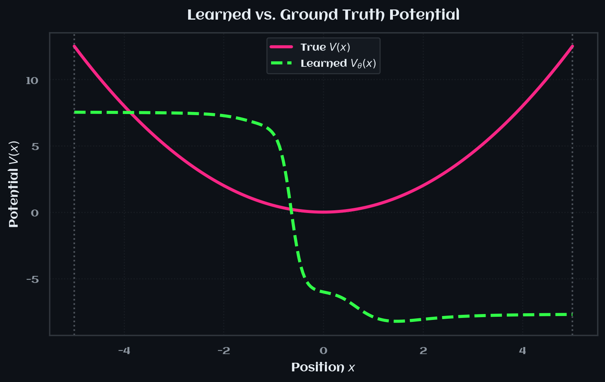

    !!! favicon "**Take-Home Message**"

        The learned potential $V_\theta(x)$ (sigmoidal) differs markedly from the harmonic ground truth $V(x)=\tfrac12 x^2$.

    ??? eigenote "🔑 Key Insights"

        1. Central regions of the learned eigenfunctions (Fig. 3) and densities (Fig. 5) match the ground truth far better than the tails.
        2. The model learns only the portion of $H_\theta$ required to reproduce high-probability regions, :ember: **exposing the inverse problem's under-determinism**.

    ??? fail "❌ **Failure Modes**"

        | **Verdict** | **Failure Mode**              | **Description**                                                                          | **Explanation**                                                    |
        |:------------|:------------------------------|:-----------------------------------------------------------------------------------------|:-------------------------------------------------------------------|
        | ❌           | Gemoetric mismatch       | Learned $V_\theta$ shape incompatible with true quadratic.                               | Central well too narrow; tails saturate at $V_\theta \approx \pm 12 $. |
        | ❌           | Boundary under-constraint | Sparse data at $x \in (-\infty, -4.5] \cup [4.5, \infty)$ allows the potential to drift. | Grey dashed domain limits show no training points beyond. |

!!! eigenote "Figure 3 – $\{\psi_n^\theta\}$ vs. $\{\psi_n\}$"

    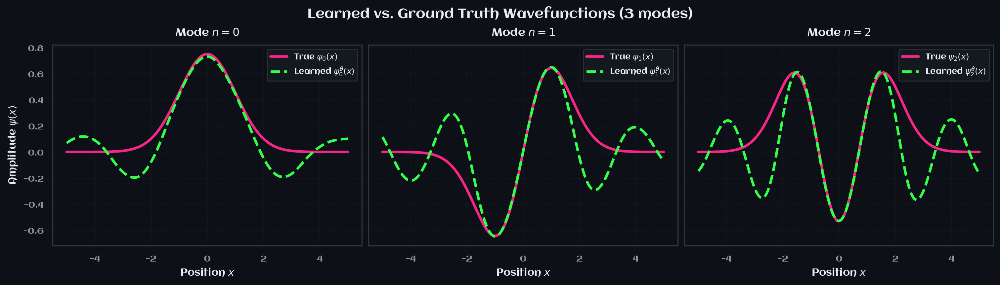

    !!! favicon "**Take-Home Message**"

        Learned eigenfunctions $\psi_n^\theta(x)$ capture the nodal pattern but diverge in low-amplitude tail regions.

    ??? eigenote "🔑 Key Insights"

        1. **Phase matching** - Correct nodal count confirms energy ordering.
        2. **Central accuracy** - Highest fidelity occurs where $|\psi_n|^2$ is largest.
        3. **Tail divergence** - For $x \in (-4.5, -2] \cup [2, 4.5)$, the learned curves overshoot, reflecting data scarcity.

    ??? fail "❌ Failure Modes"

        | **Verdict** | **Failure Mode** | **Description** | **Explanation**                            |
        | :---------- | :--------------- | :-------------- |:-------------------------------------------|
        | ❌ | Nodal mis-count | Extra nodes appear beyond $x \approx \pm 3$) | Indicates spectral leakage.                |
        | ✔️ | Sign / parity flip | Unaligned solutions may invert parity | Sign aligned; parity matches ground truth. |
        | ❌ | Spurious oscillations | High-frequency ripples in tails from weak $V_\theta$ smoothness. | Visible beyond $x\approx \pm 4$.           |

!!! eigenote "Figure 4 – $\{E_n^\theta\}$ vs. $\{E_n\}$"

    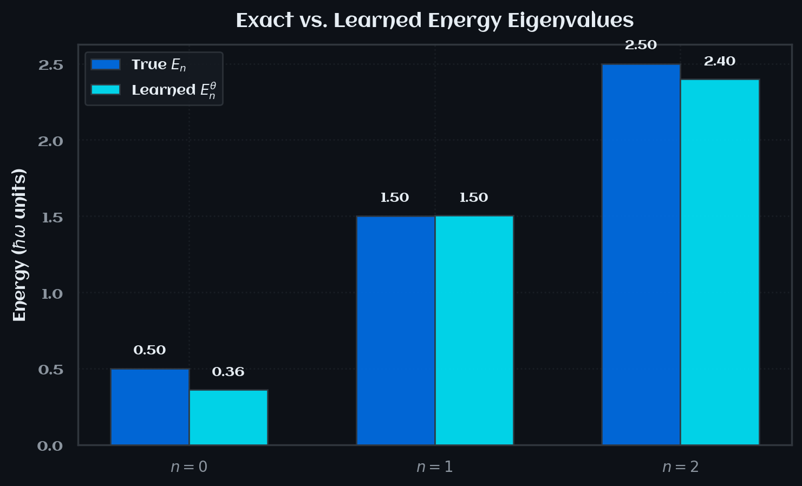

    !!! favicon "**Take-Home Message**"

        Learned energies $E_n^\theta$ follow the harmonic spectrum $E_n=n+\tfrac12$ and match observations within 5 %.

    ??? eigenote "__🔑 **Key Insights**__"
    
        1. Correct ordering suggests $\mathcal{L}_\text{order}$ is effective.
        2. Spectrum remains stable despite 2z% Gaussian noise in training data.
    
    ??? fail "__❌ **Failure Modes**__"
    
        | **Verdict** | **Failure Mode** | **Description** | **Explanation** |
        | :---------- | :--------------- | :-------------- | :-------------- |
        | ❌ | Spectral fit, wrong operator | Energies match, but $V_\theta$ deviates (see Fig. 2) |

!!! eigenote "Figure 5 - $\{|\psi_n^\theta|^2\}$ vs.$\{\rho_n^\text{observed}\}$"

    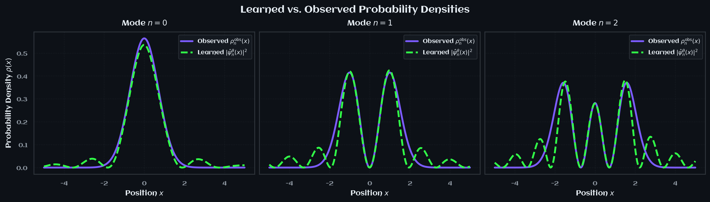

    !!! favicon "**Take-Home Message**"
    
        Learned densities, $\rho_n^\theta = |\psi_n^\theta|^2$ agree with 2%-noise observations.
    
    ??? eigenote "__🔑 **Key Insights**__"
    
        1. **Noise filtering** - PINN acts as a physics-informed smoother.
        2. **Data dominance** - Good density fit persists even with incorrect potential (Fig. 2), confirming $\mathcal{L}_\text{data}$ is easy to minimize.
    
    ??? fail "❌ **Failure Modes**"
    
        | **Verdict** | **Failure Mode** | **Description** | **Explanation** |
        | :---------- | :--------------- | :-------------- | :-------------- |
        | ✔️ | Peak flattening | Excessive $\lambda_\text{smooth}$ can lower peaks | Peaks are preserved $\Rightarrow$ smoothing is well-tuned. |
        | ✔️ | Mode merging | Energy mis-ordering can collapse multiple states onto one density. |

## POD Analysis

!!! eigenote "Figure 6 - POD Singular Values"

    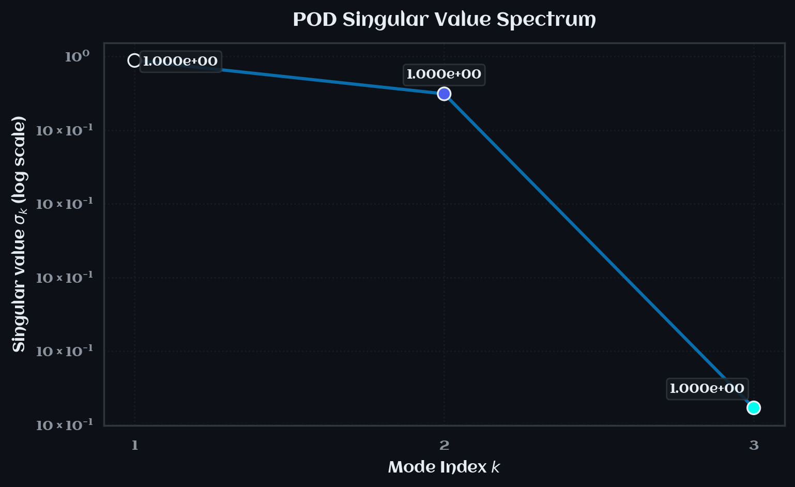

    !!! favicon "**Take-Home Message**"

        Singular values from the POD of the learned wavefunction matrix decrease (log scale) from $\approx 1$.

    ??? eigenote "🔑 **Key Insights**"
    
        1. **Rank efficiency** - Rapid two-decade decay indicates a low-dimensional basis.
        2. **Basis conditioning** - Separation between $\sigma_0$, $\sigma_1$, and $\sigma_2$ quantifies how much "physics" each node carries.
    
    ??? fail "❌ **Failure Modes**"
    
        | **Verdict** | **Failure Mode** | **Description** | **Explanation**                                            |
        | :---------- | :--------------- | :-------------- |:-----------------------------------------------------------|
        | ❌ | Flat spectrum | All $\sigma_i$ nearly equal $\Rightarrow$ modes are independent, but unphysical. | **Noise-dominated snapshots.** or over parameterization.** The PINN is outputting random high-frequency noise or unconstrained oscillations rather than smooth quantum states. |
        | ❌ | Slow decay | $\tfrac{\sigma_{2}}{\sigma_{0}} \geq 0.3 \Rightarrow$ redundant or correlated modes. | **Underfitting or aliasing in learned wavefunctions.** The PINN is struggling to resolve sharp potential barriers causing energy to spread across many modes rather than capturing it in a single eigenstate. |
    
!!! eigenote "Figure 7 – Mutual overlap heatmap (learned eigenfunctions)"

    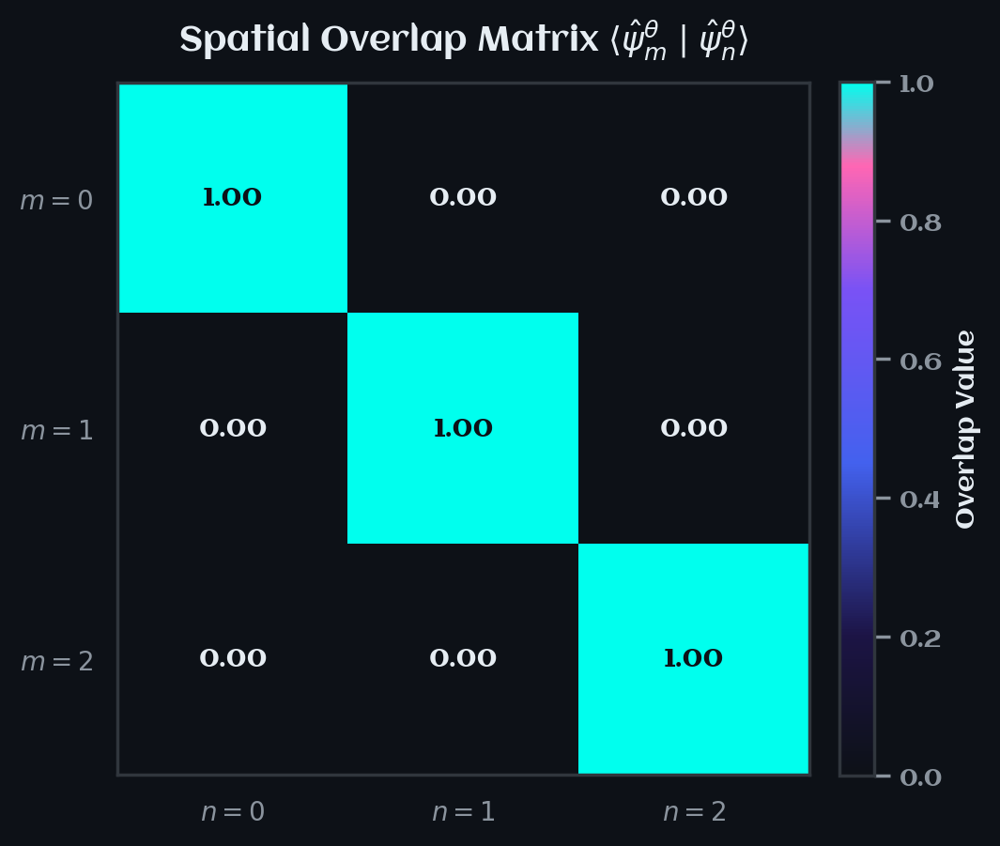{: .image-medium}

    !!! favicon "**Take-Home Message**"
        
        Mutual inner product matrix $\langle \hat{\psi}_m^\theta | \hat{\psi}_n^\theta \rangle $ forms an exact identity
        matrix.
    
    ??? "🔑 **Key Insights**"
        
        1. **Strict mutual orthogonality:** - Diagonals are identically $1.00$ and all off-diagonal entries are $0.00$.
        2. **Hermetian Basis Property:** - Learned eigenfunctions constitute a numericall orthonormal spatial set.
    
    ??? fail "❌ **Failure Modes**"
    
        | **Verdict** | **Failure Mode** | **Description** | **Explanation** |
        | :---------- | :--------------- | :-------------- | :-------------- |
        | ✔️ | Non-orthogonality | Off-diagonal entries exceed $0.10$. | Here, max off-diagonal is $\ge 0.00$ confirming orthonormal learned state representation. | 

!!! eigenote "Figure 8 - $\{u_n\}$ vs. $\{\hat{\psi}_n^\theta\}$ vs. $\{\hat{\psi}_n\}$"

    - [ ] Change $u_k$ in title and axis labels to $\sigma_k$

    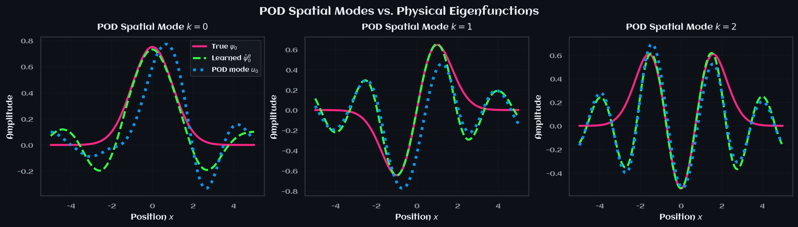

    !!! favicon "**Take-Home Message**"

        Spatial mode mixing results in deviation of POD spatial modes $\mathbf{\sigma}_k$ from physical eigenfunctiona.

    ??? eigenote "🔑 **Key Insights**"
    
        1. **Spatial shift:** POD mode $\sigma_0(x)$ is shifted horizontally relativr to symmetric ground truth $\psi_0(x)$.
        2. **Asymmetric amplitude:** POD mode $\sigma_1(x)$ exhibits assymmetric peak/trough amplitudes ($-0.8$ vs. $+0.45$).
        3. **Mixed coordinate frame:** SVD spatial modes represent linear combinations of learned states rather than pure eigenstates.
    
    ??? fail "❌ **Failure Modes**"
    
        | **Verdict** | **Failure Mode** | **Description** | **Explanation** |
        | :---------- | :--------------- | :-------------- | :-------------- |
        | ❌ | Mode mixing | POD modes fail to align with ground truth eigenfunctions. | Significant spatial distortion and asymmetry in $\sigma_0$ and $\sigma_1$ POD modes. |

!!! eigenote "Figure 9 - Cross-overlap heatmap (POD modes vs. learned eigenfunctions)"

    - [ ] Choose different color scale for more intuitive visualization
    - [ ] Change $u_k$ in title and axis labels to $\sigma_k$

    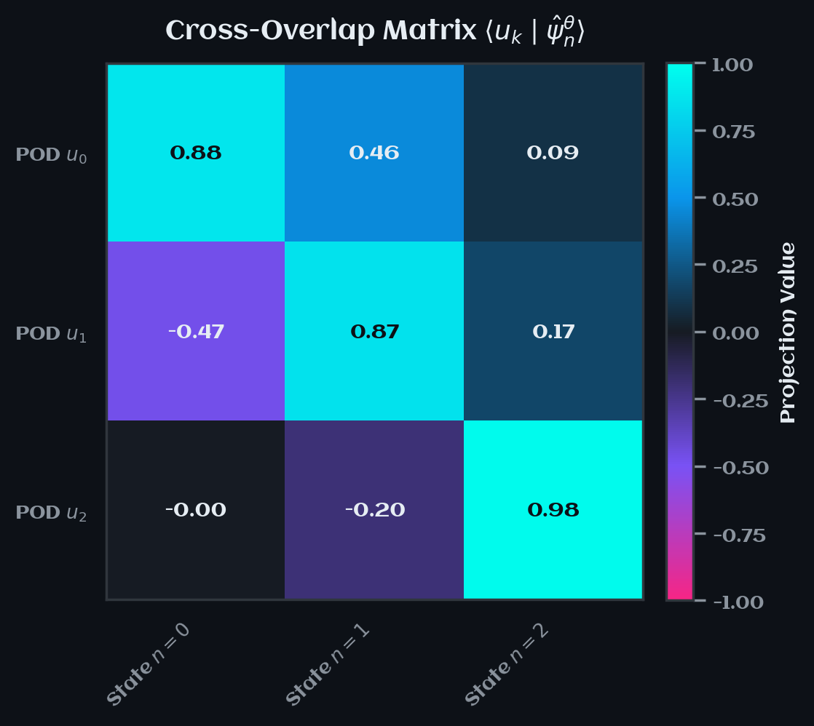{: .image-medium}

    !!! favicon "**Take-Home Message**"
    
        Cross-projections $\langle \sigma_k | \hat{\psi}_n^\theta \rangle$ reveal strong non-diagonal coupling between POD modes and learned wavefunctions.
    
    ??? eigenote "🔑 **Key Insights**"
    
        1. **Rotated basis:** Ideal result is $\pm$ identity; here large off-diagonals show mis-alignment.

            - **Primary projections:** $\langle \sigma_0 | \hat{\psi}_0^\theta \rangle = 0.88$, $\langle \sigma_1 | \hat{\psi}_1^\theta \rangle = 0.87$,
              and $\langle \sigma_2 | \hat{\psi}_2^\theta \rangle = 0.98$.

        2. **Off-Diagonal Cross Talk: Significant off-diagonal components:** $\langle \sigma_0 | \hat{\psi}_1^\theta \rangle = 0.46$,
             and $\langle \sigma_1 | \hat{\psi}_0^\theta \rangle = -0.47$, and $\langle \sigma_2 | \hat{\psi}_1^\theta \rangle = -0.20$).
    
    ??? fail "❌ **Failure Modes**"
    
        | **Verdict** | **Failure Mode** | **Description**                                           | **Explanation** |
        | :---------- | :--------------- |:----------------------------------------------------------| :-------------- |
        | ❌ | Distributed overlap | Non-diagonal matrix entries exceed tolerance. | Off-diagonals reach magnitudes up to $0.47$, confirming basis rotation.   🔮 Further investigation required to understand the root cause and impact on POD basis stability and interpretability.   - [ ] Make sure this isn't being caused by a missed wieghting step |

    

!!! eigenote "Figure 10 - POD Eigenfunction Alignment"

    - [ ] Choose different color scale for more intuitive visualization
    - [ ] Change $u_k$ in title and axis labels to $\sigma_k$

    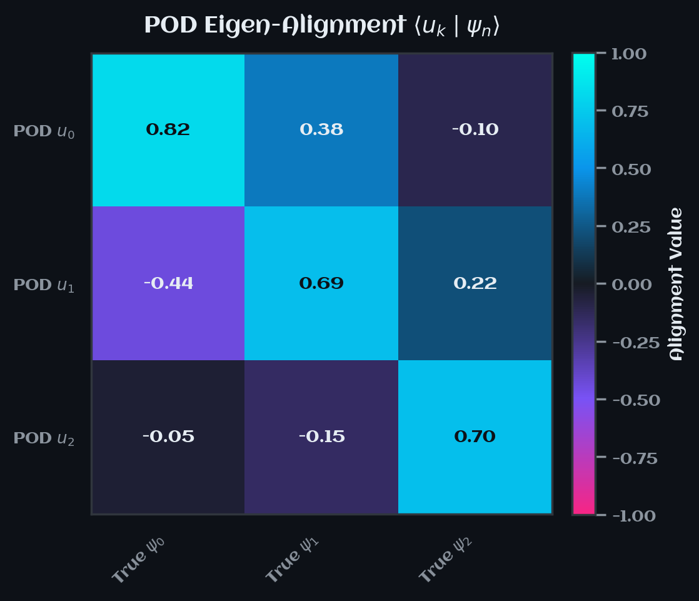{: .image-medium}

    !!! favicon "**Take-Home Message**"
    
        Heavy mode mixing between POD spatial modes and ground-truth eigenfunctions indicate imperfect physical recovery.
    
    ??? eigenote "🔑 **Key Insights**"
    
        1. **Diagonal attenuation:** Overlap values along diagonals are 

            $$
                \begin{align*}
                    \langle \sigma_0 | \hat{\psi}_0 \rangle &= 0.82 \\ \\
                    \langle \sigma_1 | \hat{\psi}_1 \rangle &= 0.69 \\ \\
                    \langle \sigma_2 | \hat{\psi}_2 \rangle &= 0.20
                \end{align*}
            $$

        2. **Physical cross-talk:** Substantial projection onto adjacent physical eigenstates (e.g., $-0.44$ and $+0.38$).
    
    ??? fail "❌ **Failure Modes**"

        | **Verdict** | **Failure Mode** | **Description** | **Explanation** |
        | :---------- | :--------------- | :-------------- | :-------------- |
        | ❌ | Mis-alignment | Off-diagonal $> 0.2$ or diagonal $< 0.90$ indicates POD not yet physical. | Off-diagonals reache $-0.44$ and diagonals drop to $0.69$. | 

!!! eigenote "Figure 11 - Temporal Modes"

    - [ ] Choose different color scale for more intuitive visualization.
    - [ ] Rewrite Take-Home Message to reflect your own understanding of the figure. Current description is not clear and is a placeholder.

    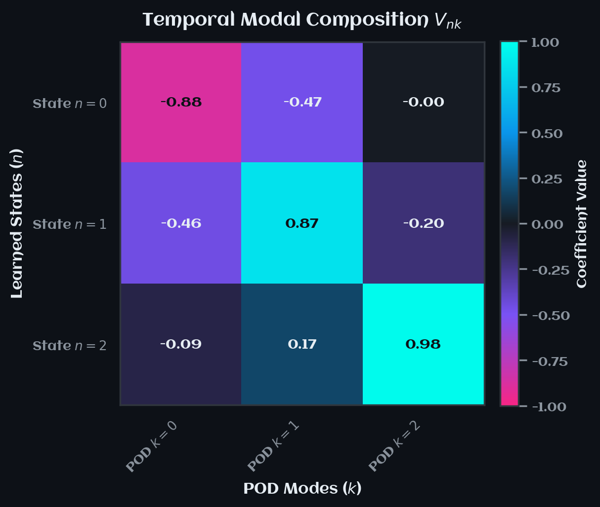{ .image-medium }

    !!! favicon "**Take-Home Message**"
    
        Right singular matrix components $V_{nk}$ reflect modal participation of POD basis vectors across learned states.
    
    ??? eigenote "🔑 **Key Insights**"
    
        1. **Modal composition:** State $0$ draws from $\sigma_0$ ($-0.88$), and $\sigma_1$ ($-0.47$). State $1$ draws from $\sigma_0$ ($-0.46$) and $\sigma_1$ ($+0.87$).

        2. **State doubling:** State $2$ is pre-dominantly aligned with $\sigma_2$ ($0.98$). 
    
    ??? fail "❌ **Failure Modes**"
    
        | **Verdict** | **Failure Mode** | **Description** | **Explanation** |
        | :---------- | :--------------- | :-------------- | :-------------- |
        | ❌ | Incoherent coefficients | Scatter if non-zero coefficients across temporal mode entries. | States $0$ and $1$ exhisbit multi-mode particiption rather than diagonal isolation. |

!!! eigenote "Figure 12 - Temporal overlap heatmap"

    - [ ] Choose different color scale for more intuitive visualization.
    - [ ] Consider using a diverging color scale to highlight the diagonal structure.
    - [ ] Adjust colorbar limits to better represent the range of values.
    - [ ] Normalize color scale to emphasize diagonal structure.

    {: .image-medium}

    !!! favicon "Take-Home Message"
    
        Orthogonality of right singular vectors $\langle v_m | v_n \rangle$, conforms to exact unitary requirements.
    
    ??? eigenote "🔑 **Key Insights**"
    
        1. **Unitary property** - Diagonals equal $1.00$ and off-diagonals equal to $\pm 0.00$.

        2. **SVD Consistency:** - Confirms numerical precision of the underlying SVD algorithm
    
    ??? fail "❌ **Failure Modes**"
    
        | **Verdict** | **Failure Mode** | **Description**                                                                                  | **Explanation**                                                                                |
        | :---------- | :--------------- |:-------------------------------------------------------------------------------------------------|:-----------------------------------------------------------------------------------------------|
        | ✔️ | Identity deviation | Off-diagonal deviation from standard identity. | Off-diagonals are identically $0.00$, fully passing unitary criteria.  |

!!! eigenote "Figure 13 - Overlap Matrix $|\langle \mathbf{e}_n | v_n \rangle|$"

    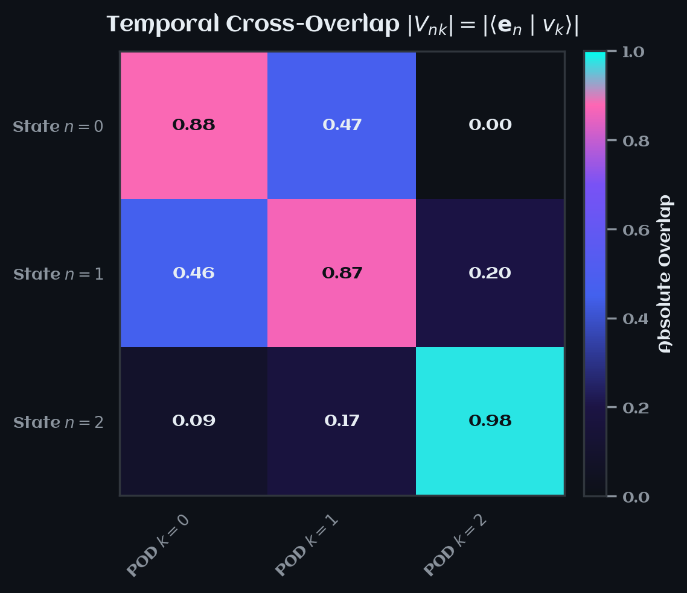{: .image-medium}

    !!! favicon "Take-Home Message"

        Absolute coefficients $|V_{nk}| = |\langle \mathbf{e}_n | v_k \rangle|$ reveal modal mixing across snapshot states.

    ??? eigenote "🔑 **Key Insights**"

        1. **Cross-state sarticipation:** Off-diagonal magnitudes reach $0.47$ ($n=0, \, k=1)$ and $0.46$ ($n=1, \, k=0)$.

        2. **Partial state isolation:** State $2$ maintains strong modal dominance with $k=2$ ($0.96$).

    ??? fail "❌ **Failure Modes**"
    
        | **Verdict** | **Failure Mode** | **Description** | **Explanation** |
        | :---------- | :--------------- | :-------------- | :-------------- |
        | ❌ | Spread dominance | Multiple temporal modes project onto single state. | States $0$ and $1$ exhibit shared weight distribution across modes $0$ and $1$. | 